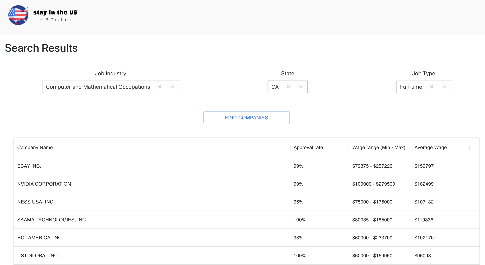
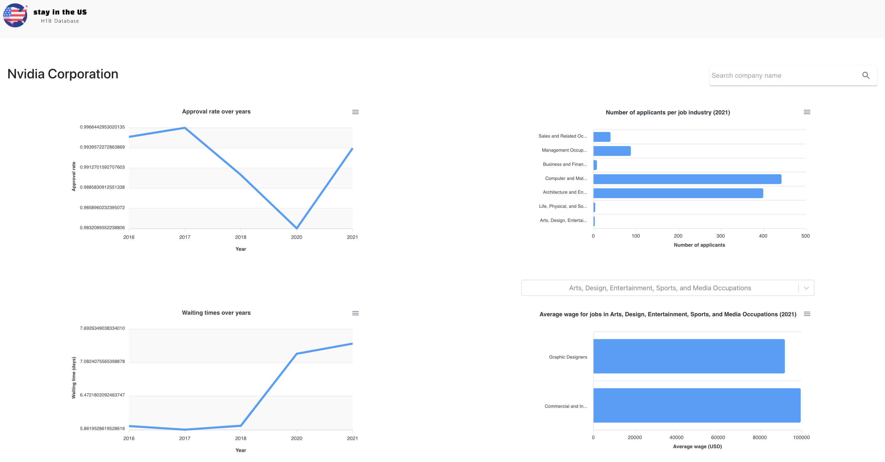
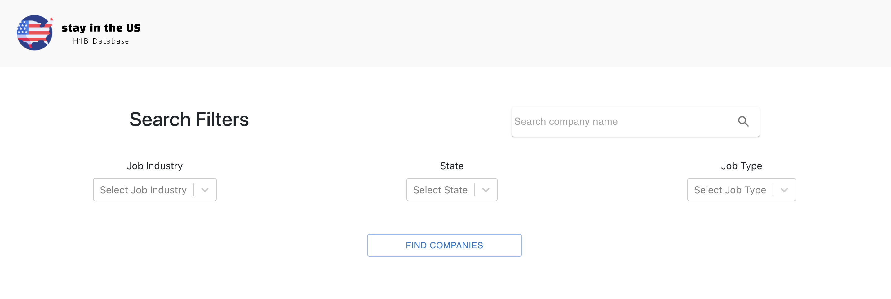

<p align="center">
 
</p>

# Visualizing H1B-Friendly Companies

This project builds a website that compiles and visualizes H1B sponsorship-related data for international users wishing to work in the US to easily search and access.

## Project Description

This is a data analysis and visualization project that displays H1B sponsorship-related data of companies based in the US through a locally hosted website. The source of the data is the annual Labor Condition Application (LCA) Disclosure Data released by the US Department of Labor of which the 2016, 2017, 2018, 2020, and 2021 data were used. 

Watch a demo of the website [here](https://www.loom.com/share/d6aabab26e6f44068160327c143e8e54).

The major search functions of the website that the users can perform include:
- Users can use search filters to access a relevant and customized set of data by using search filters. The filters they can set include the job industry they wish to work in, the US state they wish to work in, and whether they wish to work as a full-time or part-time employer.
- Users can also directly search the name of the company and access the searched company's H1B sponsorship-related data.


The H1B sponsorship-related data per company that the users can access include:
- The company's H1B LCA approval rate over the years
- The company's waiting time for H1B LCA over the years
- The number of applicants sponsored by the company per job industry in 2021 (most recent data)
- The average salary of the jobs sponsored by the company in 2021 (most recent data)


## Directory Structure
    ├── app                           <- Source files and requirements
    ├── data                          <- Data analysis codes
    │   ├── filtered_columns_data     <- Cleaned data
    ├── docs                          <- Documentation files
    ├── img                           <- Image files
    ├── LICENSE.txt
    ├── README.md
    └── logo.svg

## Run the project

### Run the project locally

The frontend and backend server of this project are in two different repos. Hence, to run the project locally, please follow this instruction closely.

1. Create a new folder to store all the code of this project
    ```bash
    # Create a new folder
    mkdir friendly-company-project

    # Checkout directory friendly-company-project
    cd friendly-company-project
    ```

2. Download the repo
    ```bash
    # Git clone the BE 
    # Link: https://github.com/minhmo1620/friendly-company
    git clone https://github.com/minhmo1620/friendly-company.git

    # Git clone the FE
    # Link: https://github.com/KareemAlsayed1/friendly-company-FE
    git clone https://github.com/KareemAlsayed1/friendly-company-FE.git
    ```
3. Run the Backend server

    Open a new terminal and run the below commands:

    _Note: The current directory ```friendly-company-project```_

    3.1 Set up the project
    ```bash
    # Go to the BE folder
    cd friendly-company

    # Go to the backend app
    cd app

    # Set up
    brew install git-lfs
    brew install python3

    # To install virtualenv via pip run:
    pip3 install virtualenv

    # Create virtual environment 
    python3 -m venv env

    # Activate virtual environment for MAC/UNIX
    source env/bin/activate

    # Activate virtual environment for WINDOWS
    env\Scripts\activate

    # Install requirements package
    pip3 install -r requirements.txt

    # If this is the first time you run the project, make sure to migrate (normally takes 10+ mins)
    python3 manage.py migrate
    ```
    3.2 Run the project
    ```bash
    # Start the project (may take > 10+ minutes to be ready)
    python3 manage.py runserver
    ```
    The backend server is up when the terminal shows
    ```
    System check identified 1 issue (0 silenced).
    April 21, 2022 - 19:31:30
    Django version 3.2.13, using settings 'backendApi.settings'
    Starting development server at http://127.0.0.1:8000/
    Quit the server with CONTROL-C.
    ```
4. Run the Frontend 
    
    Open a new terminal and run the below commands:

    _Note: The current directory ```friendly-company-project```_

    4.1 Set up the project
    ```bash
    # Go to the FE folder
    cd friendly-company-FE

    # Set up
    brew install node
    brew install npm

    # Install all the required packages
    npm install
    ```
    4.2 Run the project
    ```bash
    npm start
    ```
    The frontend server is up when the terminal shows
    ```bash
    Compiled successfully!

    You can now view react-frontend in the browser.

    Local:            http://localhost:3000
    On Your Network:  http://10.112.19.137:3000

    Note that the development build is not optimized.
    To create a production build, use npm run build.
    ```

5. Open your web browser and go to the URL ```http://localhost:3000```. The expected result is


## Built with

- [React](https://reactjs.org/)
- [Django](https://www.djangoproject.com/start/)

## Contributors
- Minh Nguyen - minh.nguyen@uni.minerva.edu
- Soomin Kim - soominkim25@uni.minerva.edu 
- Kareem Alsayed - kareem@uni.minerva.edu

## License

Distributed under the MIT License - see ```LICENSE.txt``` for more information.
