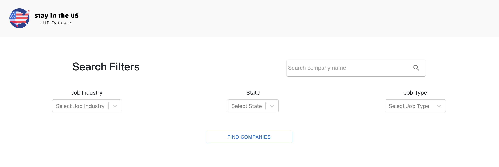

# Project Title

Simple overview of use/purpose.

## Description

An in-depth paragraph about your project and overview of use.

## Getting Started

### Dependencies

* Describe any prerequisites, libraries, OS version, etc., needed before installing program.
* ex. Windows 10
* Please make sure you install Git LFS before cloning the repo
```bash
# Install Git LFS
$ brew install git-lfs
```

### Run the project locally

The frontend and backend server of this project are in two different repos. Hence, to run the project locally, please follow this instruction closely.

1. Create a new folder to store all the code of this project
    ```bash
    # Create a new folder
    mkdir friendly-company-project

    # Checkout directory friendly-company-project
    cd friendly-company-project
    ```

2. Download the repo
    ```bash
    # Git clone the BE 
    # Link: https://github.com/minhmo1620/friendly-company
    git clone https://github.com/minhmo1620/friendly-company.git

    # Git clone the FE
    # Link: https://github.com/KareemAlsayed1/friendly-company-FE
    git clone https://github.com/KareemAlsayed1/friendly-company-FE.git
    ```
3. Run the Backend server

    Open a new terminal and run the below commands:

    _Note: The current directory ```friendly-company-project```_

    3.1 Set up the project
    ```bash
    # Go to the BE folder
    cd friendly-company

    # Go to the backend app
    cd app

    # Set up
    brew install git-lfs
    brew install python3

    # To install virtualenv via pip run:
    pip3 install virtualenv

    # Create virtual environment 
    python3 -m venv env

    # Activate virtual environment for MAC/UNIX
    env/bin/activate

    # Activate virtual environment for WINDOWS
    env\Scripts\activate

    # Install requirements package
    pip3 install -r requirements.txt

    # If this is the first time you run the project, make sure to migrate (normally takes 5 mins)
    python3 manage.py migrate
    ```
    3.2 Run the project
    ```bash
    # Start the project (may take > 5 minutes to be ready)
    python3 manage.py runserver
    ```
    The backend server is up when the terminal shows
    ```
    System check identified 1 issue (0 silenced).
    April 21, 2022 - 19:31:30
    Django version 3.2.13, using settings 'backendApi.settings'
    Starting development server at http://127.0.0.1:8000/
    Quit the server with CONTROL-C.
    ```
4. Run the Frontend 
    
    Open a new terminal and run the below commands:

    _Note: The current directory ```friendly-company-project```_

    4.1 Set up the project
    ```bash
    # Go to the FE folder
    cd friendly-company-FE

    # Set up
    brew install node
    brew install npm

    # Install all the required packages
    npm install
    ```
    4.2 Run the project
    ```bash
    npm start
    ```
    The frontend server is up when the terminal shows
    ```bash
    Compiled successfully!

    You can now view react-frontend in the browser.

    Local:            http://localhost:3000
    On Your Network:  http://10.112.19.137:3000

    Note that the development build is not optimized.
    To create a production build, use npm run build.
    ```

5. Open your web browser and go to the URL ```http://localhost:3000```. The expected result is

## Help

Any advise for common problems or issues.
```
command to run if program contains helper info
```

## License

This project is licensed under the [NAME HERE] License - see the LICENSE.md file for details
